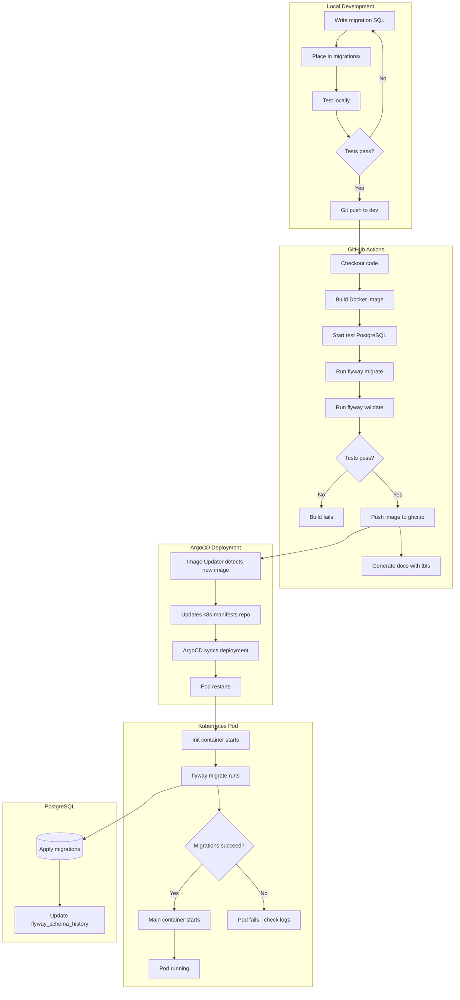

# PostgreSQL Database Migrations

## Overview

This repository manages database schema migrations for PostgreSQL using Flyway. It provides version-controlled, repeatable database changes across all environments (dev, stg, prod).

## Migration Workflow



## Quick Start

```bash
# Check migration status
./run-migration.sh info

# Run pending migrations
./run-migration.sh migrate

# Validate migrations
./run-migration.sh validate
```

## Project Structure

```
.
├── migrations/              # SQL migration files (V1__, V2__, etc.)
├── docs/                    # Auto-generated schema documentation
├── .github/
│   └── workflows/
│       └── build-test-push-doc.yml  # CI/CD pipeline
├── run-migration.sh         # Migration runner script (Docker-based)
├── Dockerfile               # Flyway Docker image
├── docker-compose.yml       # Local Docker Compose config
├── .tbls.yml                # Schema documentation config
├── .env                     # Dev database connection (not in git)
└── .gitignore
```

## Configuration

### Database Connection

Create a `.env` file with your PostgreSQL connection details:

```
FLYWAY_PGSQL_HOST=192.168.50.2
FLYWAY_PGSQL_PORT=31434
FLYWAY_PGSQL_DATABASE=postgres
FLYWAY_PGSQL_USERNAME=your-username
FLYWAY_PGSQL_PASSWORD=your-password
```

## Migration Files

### Naming Convention

```
V{version}__{description}.sql
```

Examples:
- `V1__Initial_schema.sql`
- `V2__Add_user_tables.sql`
- `V2.1__Add_user_indexes.sql` (out-of-order migration)
- `V3__Update_permissions.sql`

### Writing Migrations

1. Create a new file in the `migrations/` directory
2. Follow the naming convention above
3. Write your SQL DDL/DML statements
4. Test locally before committing

Example migration:
```sql
-- V1__Create_user_table.sql
CREATE TABLE users (
    id SERIAL PRIMARY KEY,
    username VARCHAR(50) NOT NULL UNIQUE,
    email VARCHAR(255) NOT NULL,
    created_at TIMESTAMP WITH TIME ZONE DEFAULT (CURRENT_TIMESTAMP AT TIME ZONE 'UTC')
);

CREATE INDEX idx_users_email ON users(email);
```

## Available Commands

| Command | Description |
|---------|-------------|
| `./run-migration.sh info` | Show migration status and history |
| `./run-migration.sh migrate` | Apply pending migrations |
| `./run-migration.sh validate` | Validate applied migrations |

## Development Workflow

1. **Create Migration**: Add new SQL file to `migrations/`
2. **Test Locally**: Run `./run-migration.sh migrate` against dev database
3. **Validate**: Run `./run-migration.sh validate`
4. **Push to dev**: Git push triggers CI/CD pipeline
5. **Monitor CI**: Check GitHub Actions for build status
6. **Verify Deployment**: Check pod logs in Kubernetes

## Deployment Architecture

### Environments

| Environment | Git Branch | Image Tag | Database |
|-------------|------------|-----------|----------|
| Development | dev | `:dev` | dev-postgres (31434) |
| Staging | stg | `:stg` | stg-postgres (31433) |
| Production | main | `:main` | prod-postgres (31432) |

### Kubernetes Deployment

The Flyway container runs as an **init container** pattern:

1. **Init Container** (`wst-flyway-migrate`): Runs `flyway migrate` on pod startup
2. **Main Container** (`wst-flyway-main`): Keeps pod alive for logging/troubleshooting

Migrations are triggered automatically when:
- New Docker image is pushed (ArgoCD Image Updater detects it)
- Pod is manually restarted: `kubectl rollout restart deployment/wst-flyway-{env} -n pgsql`

### Checking Deployment Status

```bash
# Find flyway pods
kubectl get pods -n pgsql | grep flyway

# Check migration logs
kubectl logs -n pgsql wst-flyway-dev-<pod-hash> -c wst-flyway-migrate

# Check flyway history table
PGPASSWORD=<password> psql -h 192.168.50.2 -p 31434 -U <user> -d postgres \
  -c "SELECT version, description, installed_on FROM flyway_schema_history ORDER BY installed_rank DESC LIMIT 5;"
```

## Best Practices

### DO
- Keep migrations small and focused
- Use descriptive migration names
- Test migrations in dev first
- Use `IF EXISTS` / `IF NOT EXISTS` for idempotency
- Add comments to tables and columns
- Follow UTC timestamp conventions

### DON'T
- Modify existing migration files (checksums will fail)
- Skip version numbers
- Include environment-specific data
- Make assumptions about existing data
- Run `migrate:clean` in production

## Troubleshooting

### Migration Failed

If a migration fails:
1. Check pod logs: `kubectl logs -n pgsql <pod> -c wst-flyway-migrate`
2. Fix the issue in your database manually if needed
3. Use `./run-migration.sh repair` to clean up failed entries
4. Fix the migration file (if not yet applied elsewhere)
5. Push fix and restart pod

### Checksum Mismatch

If you see checksum validation errors:
- Someone modified an already-applied migration file
- Use `./run-migration.sh repair` to update checksums (use with caution)

### Out of Order Migrations

Use decimal versions for migrations that need to be inserted between existing ones:
- Existing: `V2__`, `V3__`
- New: `V2.1__` (will run after V2 but before V3)

## Docker Images

Pre-built images are available at:
```
ghcr.io/x81k25/wst-flyway:dev
ghcr.io/x81k25/wst-flyway:stg
ghcr.io/x81k25/wst-flyway:main
ghcr.io/x81k25/wst-flyway:sha-<commit>
```

## Additional Resources

- [Flyway Documentation](https://documentation.red-gate.com/flyway)
- [PostgreSQL Documentation](https://www.postgresql.org/docs/)
- [Schema Documentation](./docs/README.md) (auto-generated)
