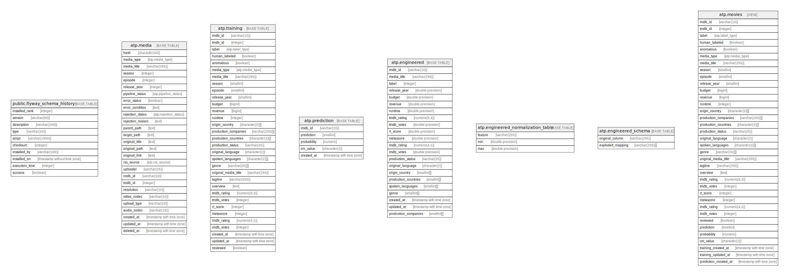

# test_db

## Tables

| Name | Columns | Comment | Type |
| ---- | ------- | ------- | ---- |
| [public.flyway_schema_history](public.flyway_schema_history.md) | 10 |  | BASE TABLE |
| [atp.media](atp.media.md) | 45 | stores media data for movies, tv shows, and tv seasons | BASE TABLE |
| [atp.training](atp.training.md) | 32 | stores training data to be ingested by reel-driver | BASE TABLE |
| [atp.prediction](atp.prediction.md) | 5 | stores training data to be ingested by reel-driver | BASE TABLE |

## Relations

---

> Generated by [tbls](https://github.com/k1LoW/tbls)
