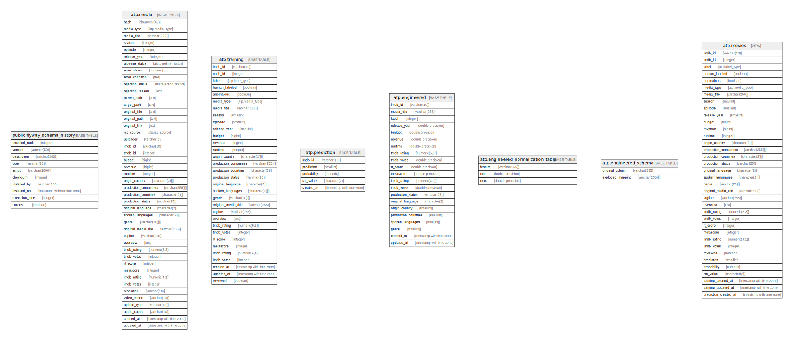

# test_db

## Tables

| Name | Columns | Comment | Type |
| ---- | ------- | ------- | ---- |
| [public.flyway_schema_history](public.flyway_schema_history.md) | 10 |  | BASE TABLE |
| [atp.media](atp.media.md) | 46 | stores media data for movies, tv shows, and tv seasons | BASE TABLE |
| [atp.training](atp.training.md) | 32 | stores training data to be ingested by reel-driver | BASE TABLE |
| [atp.prediction](atp.prediction.md) | 5 | stores training data to be ingested by reel-driver | BASE TABLE |
| [atp.engineered](atp.engineered.md) | 21 |  | BASE TABLE |
| [atp.engineered_normalization_table](atp.engineered_normalization_table.md) | 3 |  | BASE TABLE |
| [atp.engineered_schema](atp.engineered_schema.md) | 2 |  | BASE TABLE |
| [atp.movies](atp.movies.md) | 36 | Combined view of training and prediction data joined by imdb_id | VIEW |

## Stored procedures and functions

| Name | ReturnType | Arguments | Type |
| ---- | ------- | ------- | ---- |
| atp.update_updated_at_column | trigger |  | FUNCTION |
| atp.reset_on_ingestion | trigger |  | FUNCTION |
| atp.reset_error_condition | trigger |  | FUNCTION |
| atp.reset_rejection_reason | trigger |  | FUNCTION |
| atp.trg_fn_training_update_timestamp | trigger |  | FUNCTION |
| atp.trg_fn_prediction_update_timestamp | trigger |  | FUNCTION |
| atp.set_rejection_on_soft_delete | trigger |  | FUNCTION |

## Relations

---

> Generated by [tbls](https://github.com/k1LoW/tbls)
