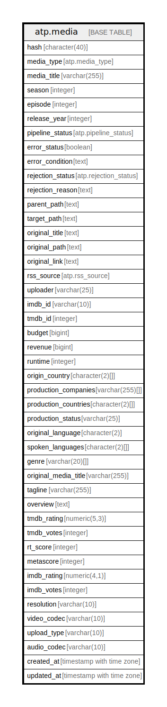

# atp.media

## Description

## Columns

| Name | Type | Default | Nullable | Children | Parents | Comment |
| ---- | ---- | ------- | -------- | -------- | ------- | ------- |
| hash | character(40) |  | false |  |  |  |
| media_type | atp.media_type |  | false |  |  |  |
| media_title | varchar(255) |  | true |  |  |  |
| season | integer |  | true |  |  |  |
| episode | integer |  | true |  |  |  |
| release_year | integer |  | true |  |  |  |
| pipeline_status | atp.pipeline_status | 'ingested'::atp.pipeline_status | false |  |  |  |
| error_status | boolean | false | false |  |  |  |
| error_condition | text |  | true |  |  |  |
| rejection_status | atp.rejection_status | 'unfiltered'::atp.rejection_status | false |  |  |  |
| rejection_reason | text |  | true |  |  |  |
| parent_path | text |  | true |  |  |  |
| target_path | text |  | true |  |  |  |
| original_title | text |  | false |  |  |  |
| original_path | text |  | true |  |  |  |
| original_link | text |  | true |  |  |  |
| rss_source | atp.rss_source |  | true |  |  |  |
| uploader | varchar(25) |  | true |  |  |  |
| imdb_id | varchar(10) |  | true |  |  |  |
| tmdb_id | integer |  | true |  |  |  |
| budget | bigint |  | true |  |  |  |
| revenue | bigint |  | true |  |  |  |
| runtime | integer |  | true |  |  |  |
| origin_country | character(2)[] |  | true |  |  |  |
| production_companies | varchar(255)[] |  | true |  |  |  |
| production_countries | character(2)[] |  | true |  |  |  |
| production_status | varchar(25) |  | true |  |  |  |
| original_language | character(2) |  | true |  |  |  |
| spoken_languages | character(2)[] |  | true |  |  |  |
| genre | varchar(20)[] |  | true |  |  |  |
| original_media_title | varchar(255) |  | true |  |  |  |
| tagline | varchar(255) |  | true |  |  |  |
| overview | text |  | true |  |  |  |
| tmdb_rating | numeric(5,3) |  | true |  |  |  |
| tmdb_votes | integer |  | true |  |  |  |
| rt_score | integer |  | true |  |  |  |
| metascore | integer |  | true |  |  |  |
| imdb_rating | numeric(4,1) |  | true |  |  |  |
| imdb_votes | integer |  | true |  |  |  |
| resolution | varchar(10) |  | true |  |  |  |
| video_codec | varchar(10) |  | true |  |  |  |
| upload_type | varchar(10) |  | true |  |  |  |
| audio_codec | varchar(10) |  | true |  |  |  |
| created_at | timestamp with time zone | (CURRENT_TIMESTAMP AT TIME ZONE 'UTC'::text) | false |  |  |  |
| updated_at | timestamp with time zone | (CURRENT_TIMESTAMP AT TIME ZONE 'UTC'::text) | false |  |  |  |

## Constraints

| Name | Type | Definition |
| ---- | ---- | ---------- |
| media_budget_check | CHECK | CHECK ((budget >= 0)) |
| media_hash_check | CHECK | CHECK (((hash ~ '^[a-f0-9]+$'::text) AND (length(hash) = 40))) |
| media_imdb_id_check | CHECK | CHECK (((imdb_id)::text ~ '^tt[0-9]{7,8}$'::text)) |
| media_imdb_rating_check | CHECK | CHECK (((imdb_rating IS NULL) OR ((imdb_rating >= (0)::numeric) AND (imdb_rating <= (100)::numeric)))) |
| media_imdb_votes_check | CHECK | CHECK ((imdb_votes >= 0)) |
| media_metascore_check | CHECK | CHECK (((metascore IS NULL) OR ((metascore >= 0) AND (metascore <= 100)))) |
| media_release_year_check | CHECK | CHECK (((release_year >= 1850) AND (release_year <= 2100))) |
| media_revenue_check | CHECK | CHECK ((revenue >= 0)) |
| media_rt_score_check | CHECK | CHECK (((rt_score IS NULL) OR ((rt_score >= 0) AND (rt_score <= 100)))) |
| media_runtime_check | CHECK | CHECK ((runtime >= 0)) |
| media_tmdb_id_check | CHECK | CHECK ((tmdb_id > 0)) |
| media_tmdb_rating_check | CHECK | CHECK (((tmdb_rating >= (0)::numeric) AND (tmdb_rating <= (10)::numeric))) |
| media_tmdb_votes_check | CHECK | CHECK ((tmdb_votes >= 0)) |
| media_pkey | PRIMARY KEY | PRIMARY KEY (hash) |

## Indexes

| Name | Definition |
| ---- | ---------- |
| media_pkey | CREATE UNIQUE INDEX media_pkey ON atp.media USING btree (hash) |
| idx_media_imdb_id | CREATE INDEX idx_media_imdb_id ON atp.media USING btree (imdb_id) |
| idx_media_tmdb_id | CREATE INDEX idx_media_tmdb_id ON atp.media USING btree (tmdb_id) |
| idx_media_pipeline_status | CREATE INDEX idx_media_pipeline_status ON atp.media USING btree (pipeline_status) |

## Relations

---

> Generated by [tbls](https://github.com/k1LoW/tbls)
