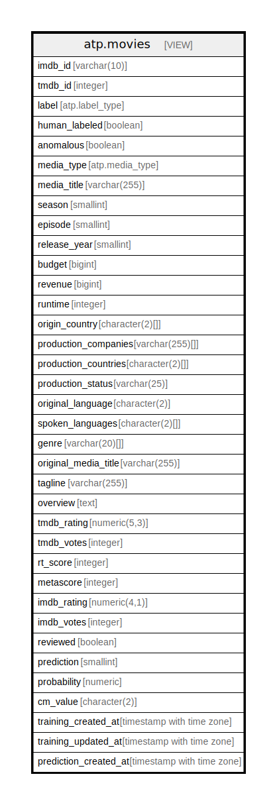

# atp.movies

## Description

Combined view of training and prediction data joined by imdb_id

<details>
<summary><strong>Table Definition</strong></summary>

```sql
CREATE VIEW movies AS (
 SELECT t.imdb_id,
    t.tmdb_id,
    t.label,
    t.human_labeled,
    t.anomalous,
    t.media_type,
    t.media_title,
    t.season,
    t.episode,
    t.release_year,
    t.budget,
    t.revenue,
    t.runtime,
    t.origin_country,
    t.production_companies,
    t.production_countries,
    t.production_status,
    t.original_language,
    t.spoken_languages,
    t.genre,
    t.original_media_title,
    t.tagline,
    t.overview,
    t.tmdb_rating,
    t.tmdb_votes,
    t.rt_score,
    t.metascore,
    t.imdb_rating,
    t.imdb_votes,
    t.reviewed,
    p.prediction,
    p.probability,
    p.cm_value,
    t.created_at AS training_created_at,
    t.updated_at AS training_updated_at,
    p.created_at AS prediction_created_at
   FROM (atp.training t
     JOIN atp.prediction p ON (((t.imdb_id)::text = (p.imdb_id)::text)))
)
```

</details>

## Columns

| Name | Type | Default | Nullable | Children | Parents | Comment |
| ---- | ---- | ------- | -------- | -------- | ------- | ------- |
| imdb_id | varchar(10) |  | true |  |  |  |
| tmdb_id | integer |  | true |  |  |  |
| label | atp.label_type |  | true |  |  |  |
| human_labeled | boolean |  | true |  |  |  |
| anomalous | boolean |  | true |  |  |  |
| media_type | atp.media_type |  | true |  |  |  |
| media_title | varchar(255) |  | true |  |  |  |
| season | smallint |  | true |  |  |  |
| episode | smallint |  | true |  |  |  |
| release_year | smallint |  | true |  |  |  |
| budget | bigint |  | true |  |  |  |
| revenue | bigint |  | true |  |  |  |
| runtime | integer |  | true |  |  |  |
| origin_country | character(2)[] |  | true |  |  |  |
| production_companies | varchar(255)[] |  | true |  |  |  |
| production_countries | character(2)[] |  | true |  |  |  |
| production_status | varchar(25) |  | true |  |  |  |
| original_language | character(2) |  | true |  |  |  |
| spoken_languages | character(2)[] |  | true |  |  |  |
| genre | varchar(20)[] |  | true |  |  |  |
| original_media_title | varchar(255) |  | true |  |  |  |
| tagline | varchar(255) |  | true |  |  |  |
| overview | text |  | true |  |  |  |
| tmdb_rating | numeric(5,3) |  | true |  |  |  |
| tmdb_votes | integer |  | true |  |  |  |
| rt_score | integer |  | true |  |  |  |
| metascore | integer |  | true |  |  |  |
| imdb_rating | numeric(4,1) |  | true |  |  |  |
| imdb_votes | integer |  | true |  |  |  |
| reviewed | boolean |  | true |  |  |  |
| prediction | smallint |  | true |  |  |  |
| probability | numeric |  | true |  |  |  |
| cm_value | character(2) |  | true |  |  |  |
| training_created_at | timestamp with time zone |  | true |  |  |  |
| training_updated_at | timestamp with time zone |  | true |  |  |  |
| prediction_created_at | timestamp with time zone |  | true |  |  |  |

## Referenced Tables

| Name | Columns | Comment | Type |
| ---- | ------- | ------- | ---- |
| [atp.training](atp.training.md) | 32 | ML training data with user labels. V30: Added missing constraints to match dev/staging schema. | BASE TABLE |
| [atp.prediction](atp.prediction.md) | 5 | stores training data to be ingested by reel-driver | BASE TABLE |

## Relations



---

> Generated by [tbls](https://github.com/k1LoW/tbls)
