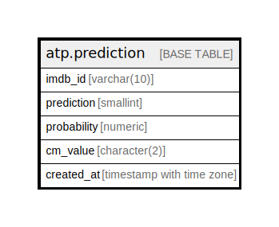

# atp.prediction

## Description

stores training data to be ingested by reel-driver

## Columns

| Name | Type | Default | Nullable | Children | Parents | Comment |
| ---- | ---- | ------- | -------- | -------- | ------- | ------- |
| imdb_id | varchar(10) |  | false |  |  | IMDB identifier for media item, and the primary key for this column |
| prediction | smallint |  | false |  |  | model prediction value, 1 for would_watch and 0 for would_not_watch |
| probability | numeric |  | false |  |  | probability of would_watch on 0 to 1 scale |
| cm_value | character(2) |  | false |  |  | confusion matrix value, either ture positive, true negative, false postivie or false negative |
| created_at | timestamp with time zone | (CURRENT_TIMESTAMP AT TIME ZONE 'UTC'::text) | false |  |  | timestamp for initial database creation of item |

## Constraints

| Name | Type | Definition |
| ---- | ---- | ---------- |
| prediction_imdb_id_check | CHECK | CHECK (((imdb_id)::text ~ '^tt[0-9]{7,8}$'::text)) |
| prediction_prediction_check | CHECK | CHECK ((prediction = ANY (ARRAY[0, 1]))) |
| prediction_pkey | PRIMARY KEY | PRIMARY KEY (imdb_id) |

## Indexes

| Name | Definition |
| ---- | ---------- |
| prediction_pkey | CREATE UNIQUE INDEX prediction_pkey ON atp.prediction USING btree (imdb_id) |

## Triggers

| Name | Definition |
| ---- | ---------- |
| trg_prediction_update_timestamp | CREATE TRIGGER trg_prediction_update_timestamp BEFORE UPDATE ON atp.prediction FOR EACH ROW EXECUTE FUNCTION atp.trg_fn_prediction_update_timestamp() |

## Relations

---

> Generated by [tbls](https://github.com/k1LoW/tbls)
