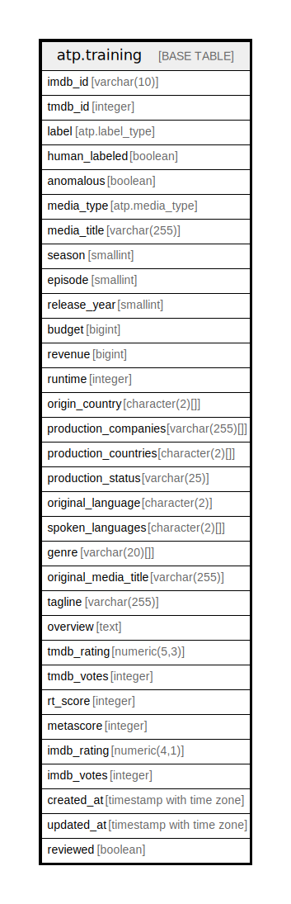

# atp.training

## Description

ML training data with user labels. V31: Standardized timestamp triggers.

## Columns

| Name | Type | Default | Nullable | Children | Parents | Comment |
| ---- | ---- | ------- | -------- | -------- | ------- | ------- |
| imdb_id | varchar(10) |  | false |  |  | from TMDB; IMDB identifier for media item, and the primary key for this column |
| tmdb_id | integer |  | true |  |  | from TMDB; identifier for themoviedb.org API |
| label | atp.label_type |  | true |  |  | training label enum value for model ingestion |
| human_labeled | boolean | false | false |  |  | flag value that indicates a user change of the label value |
| anomalous | boolean | false | false |  |  | user set flag for media items frequently appear as false postives or false negatvies in model results, but have been verified to be correct |
| media_type | atp.media_type |  | false |  |  | either movie, tv_shows, or tv_season |
| media_title | varchar(255) |  | false |  |  | either movie or tv show title |
| season | smallint |  | true |  |  | media season if tv show or tv season; null for movies |
| episode | smallint |  | true |  |  | episode number within season for tv show, otherwise null |
| release_year | smallint |  | false |  |  | year the movie was released or the year of the first season of a tv show |
| budget | bigint |  | true |  |  | from TMDB; production budget of media item |
| revenue | bigint |  | true |  |  | from TMDB; current revenue of media item |
| runtime | integer |  | true |  |  | from TMDB; runtime in minutes of media item |
| origin_country | character(2)[] |  | true |  |  | from TMDB; primary country of production in iso_3166_1 format |
| production_companies | varchar(255)[] |  | true |  |  | from TMDB; array of production companies |
| production_countries | character(2)[] |  | true |  |  | from TMDB; array of countries where media item was produced in iso_3166_1 format |
| production_status | varchar(25) |  | true |  |  | from TMDB; current production status of media item |
| original_language | character(2) |  | true |  |  | from TMDB; primary language of media item in ISO 639 format |
| spoken_languages | character(2)[] |  | true |  |  | from TMDB; array of languages available encoded in ISO 639 format |
| genre | varchar(20)[] |  | true |  |  | from TMDB; array of genres associated with the movie |
| original_media_title | varchar(255) |  | true |  |  | from TMDB; original title of media item |
| tagline | varchar(255) |  | true |  |  | from TMDB; tagline for the media item |
| overview | text |  | true |  |  | from TMDB; brief plot synopsis of media item |
| tmdb_rating | numeric(5,3) |  | true |  |  | from TMDB; rating submitted by TMDB users out of 10 |
| tmdb_votes | integer |  | true |  |  | from TMDB; number of ratings by TMDB users |
| rt_score | integer |  | true |  |  | Rotten Tomatoes score |
| metascore | integer |  | true |  |  | MetaCritic score |
| imdb_rating | numeric(4,1) |  | true |  |  | IMDB rating out of 100 |
| imdb_votes | integer |  | true |  |  | number of votes on IMDB |
| created_at | timestamp with time zone | (CURRENT_TIMESTAMP AT TIME ZONE 'UTC'::text) | false |  |  | timestamp for initial database creation of item |
| updated_at | timestamp with time zone | (CURRENT_TIMESTAMP AT TIME ZONE 'UTC'::text) | false |  |  | timestamp of last database alteration of item |
| reviewed | boolean | false | true |  |  | deterines if training label has been confirmed as accurate |

## Constraints

| Name | Type | Definition |
| ---- | ---- | ---------- |
| training_budget_check | CHECK | CHECK ((budget >= 0)) |
| training_imdb_id_check | CHECK | CHECK (((imdb_id)::text ~ '^tt[0-9]{7,8}$'::text)) |
| training_imdb_rating_check | CHECK | CHECK (((imdb_rating IS NULL) OR ((imdb_rating >= (0)::numeric) AND (imdb_rating <= (100)::numeric)))) |
| training_imdb_votes_check | CHECK | CHECK ((imdb_votes >= 0)) |
| training_metascore_check | CHECK | CHECK (((metascore IS NULL) OR ((metascore >= 0) AND (metascore <= 100)))) |
| training_release_year_check | CHECK | CHECK (((release_year >= 1850) AND (release_year <= 2100))) |
| training_revenue_check | CHECK | CHECK ((revenue >= 0)) |
| training_rt_score_check | CHECK | CHECK (((rt_score IS NULL) OR ((rt_score >= 0) AND (rt_score <= 100)))) |
| training_runtime_check | CHECK | CHECK ((runtime >= 0)) |
| training_tmdb_id_check | CHECK | CHECK ((tmdb_id > 0)) |
| training_tmdb_rating_check | CHECK | CHECK (((tmdb_rating >= (0)::numeric) AND (tmdb_rating <= (10)::numeric))) |
| training_tmdb_votes_check | CHECK | CHECK ((tmdb_votes >= 0)) |
| training_pkey | PRIMARY KEY | PRIMARY KEY (imdb_id) |
| training_tmdb_id_key | UNIQUE | UNIQUE (tmdb_id) |

## Indexes

| Name | Definition |
| ---- | ---------- |
| training_pkey | CREATE UNIQUE INDEX training_pkey ON atp.training USING btree (imdb_id) |
| training_tmdb_id_key | CREATE UNIQUE INDEX training_tmdb_id_key ON atp.training USING btree (tmdb_id) |
| idx_training_tmdb_id | CREATE INDEX idx_training_tmdb_id ON atp.training USING btree (tmdb_id) |

## Triggers

| Name | Definition |
| ---- | ---------- |
| trg_training_update_timestamp | CREATE TRIGGER trg_training_update_timestamp BEFORE UPDATE ON atp.training FOR EACH ROW EXECUTE FUNCTION atp.set_updated_at() |

## Relations

---

> Generated by [tbls](https://github.com/k1LoW/tbls)
