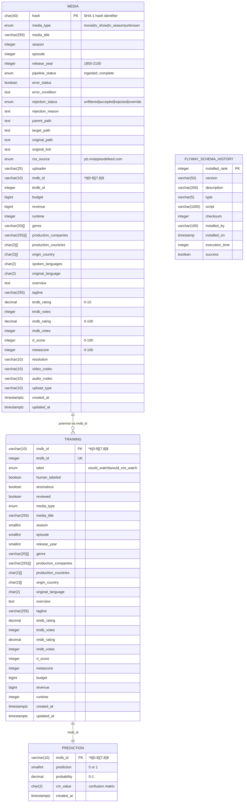

# Migration Plan

## Overview

This document outlines the migration plan for restructuring the ATP (Automatic Transmission Pipeline) database schema to better represent the shape of the data.

## Current State

The current database schema consists of multiple tables across two schemas (`public` and `atp`) that support an automated media acquisition and processing pipeline with machine learning capabilities.

### Current Schema ERD

### Schema Characteristics

#### Current Architecture Issues
1. **Redundant Data Storage**: Similar columns exist across multiple tables (media, training, engineered)
2. **Denormalized Structure**: Arrays of production companies, genres, countries stored as columns
3. **Mixed Concerns**: Pipeline status, media metadata, and ML features in same tables
4. **Inefficient Lookups**: No proper normalization for frequently queried attributes
5. **Data Type Inconsistencies**: Same fields have different types across tables (e.g., season as integer vs smallint)

## Objectives

1. **Normalize the schema** to reduce redundancy and improve data integrity
2. **Separate concerns** by splitting pipeline management, media metadata, and ML features
3. **Improve query performance** through proper indexing and relationships
4. **Standardize data types** across all tables
5. **Create proper foreign key relationships** to ensure referential integrity

## Scope

### In Scope
- All tables in the `atp` schema
- Migration of existing data to new structure
- Index optimization
- Foreign key constraint implementation
- View updates

### Out of Scope
- Changes to the Flyway migration framework
- Application code changes (to be handled separately)
- Performance testing (separate task)

## Migration Steps

### Phase 1: Preparation
- Document all dependencies
- Backup current database
- Create rollback scripts
- Test migration in development environment

### Phase 2: Execution
- Create new normalized tables
- Migrate data with transformation
- Create foreign key constraints
- Update views and indexes

### Phase 3: Validation
- Verify data integrity
- Check constraint compliance
- Validate application functionality
- Performance testing

### Phase 4: Cleanup
- Drop deprecated tables/columns
- Update documentation
- Archive old schema definitions

## Rollback Plan

1. Keep original tables intact during migration
2. Maintain dual-write capability during transition
3. Create reverse migration scripts
4. Test rollback procedure in staging

## Risk Assessment

### High Risk
- Data loss during migration
- Application downtime
- Foreign key constraint violations

### Medium Risk
- Performance degradation
- Incomplete data migration
- View dependencies

### Low Risk
- Documentation updates
- Index rebuilding time

## Success Criteria

- Zero data loss
- All constraints satisfied
- Application functionality preserved
- Query performance improved or maintained
- Successful rollback test

## Post-Migration Tasks

- Update application ORM mappings
- Refresh materialized views
- Update monitoring dashboards
- Documentation updates
- Performance baseline establishment