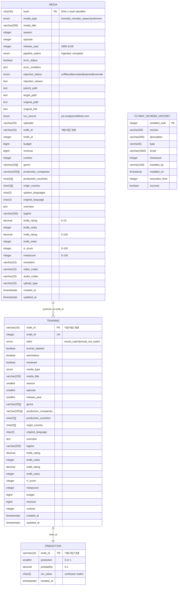

# Migration Plan

## Overview

This document outlines the migration plan for restructuring the ATP (Automatic Transmission Pipeline) database schema to better represent the shape of the data.

## Current State

The current database schema consists of multiple tables across two schemas (`public` and `atp`) that support an automated media acquisition and processing pipeline with machine learning capabilities.

### Current Schema ERD



### Schema Characteristics

#### Current Architecture Issues
1. **Redundant Data Storage**: Similar columns exist across multiple tables (media, training, engineered)
2. **Denormalized Structure**: Arrays of production companies, genres, countries stored as columns
3. **Mixed Concerns**: Pipeline status, media metadata, and ML features in same tables
4. **Inefficient Lookups**: No proper normalization for frequently queried attributes
5. **Data Type Inconsistencies**: Same fields have different types across tables (e.g., season as integer vs smallint)

## Objectives

1. **Normalize the schema** to reduce redundancy and improve data integrity
2. **Separate concerns** by splitting pipeline management, media metadata, and ML features
3. **Improve query performance** through proper indexing and relationships
4. **Standardize data types** across all tables
5. **Create proper foreign key relationships** to ensure referential integrity

## Scope

### In Scope
- All tables in the `atp` schema
- Migration of existing data to new structure
- Index optimization
- Foreign key constraint implementation
- View updates

### Out of Scope
- Changes to the Flyway migration framework
- Application code changes (to be handled separately)
- Performance testing (separate task)

## Migration Steps

### Phase 1: Preparation
- Document all dependencies
- Backup current database
- Create rollback scripts
- Test migration in development environment

### Phase 2: Execution
- Create new normalized tables
- Migrate data with transformation
- Create foreign key constraints
- Update views and indexes

### Phase 3: Validation
- Verify data integrity
- Check constraint compliance
- Validate application functionality
- Performance testing

### Phase 4: Cleanup
- Drop deprecated tables/columns
- Update documentation
- Archive old schema definitions

## Rollback Plan

1. Keep original tables intact during migration
2. Maintain dual-write capability during transition
3. Create reverse migration scripts
4. Test rollback procedure in staging

## Risk Assessment

### High Risk
- Data loss during migration
- Application downtime
- Foreign key constraint violations

### Medium Risk
- Performance degradation
- Incomplete data migration
- View dependencies

### Low Risk
- Documentation updates
- Index rebuilding time

## Success Criteria

- Zero data loss
- All constraints satisfied
- Application functionality preserved
- Query performance improved or maintained
- Successful rollback test

## Post-Migration Tasks

- Update application ORM mappings
- Refresh materialized views
- Update monitoring dashboards
- Documentation updates
- Performance baseline establishment

## New Schema Design

### Overview
The new schema design separates concerns by creating four specialized tables that better represent the underlying data structures:

1. **`downloads`** - Active download tracking and management
2. **`files`** - Final output file metadata and storage
3. **`media_metadata`** - Core media information (movies/shows)
4. **`media_metrics`** - Algorithmically derived metrics and ML predictions

### Table Structures

#### 1. downloads Table
Manages all information about current and historical media downloads from various sources. Uses the SHA-1 hash as the primary key since it's globally unique and directly represents the download.

```sql
CREATE TABLE atp.downloads (
    -- Primary key - using hash as natural key
    hash CHAR(40) PRIMARY KEY CHECK (hash ~ '^[a-f0-9]+$' AND length(hash) = 40),
    
    -- Download source information
    original_title TEXT NOT NULL,
    original_path TEXT,
    original_link TEXT,
    rss_source atp.rss_source,
    uploader VARCHAR(25),
    
    -- Download status tracking
    pipeline_status atp.pipeline_status NOT NULL DEFAULT 'ingested',
    error_status BOOLEAN DEFAULT FALSE NOT NULL,
    error_condition TEXT,
    rejection_status atp.rejection_status NOT NULL DEFAULT 'unfiltered',
    rejection_reason TEXT,
    
    -- Video/Audio metadata
    resolution VARCHAR(10),
    video_codec VARCHAR(10),
    audio_codec VARCHAR(10),
    upload_type VARCHAR(10),
    
    -- Foreign key to media
    imdb_id VARCHAR(10) REFERENCES atp.media_metadata(imdb_id),
    
    -- Timestamps
    created_at TIMESTAMP WITH TIME ZONE DEFAULT (CURRENT_TIMESTAMP AT TIME ZONE 'UTC') NOT NULL,
    updated_at TIMESTAMP WITH TIME ZONE DEFAULT (CURRENT_TIMESTAMP AT TIME ZONE 'UTC') NOT NULL
);

CREATE INDEX idx_downloads_pipeline_status ON atp.downloads(pipeline_status);
CREATE INDEX idx_downloads_imdb_id ON atp.downloads(imdb_id);
CREATE INDEX idx_downloads_created_at ON atp.downloads(created_at);
```

#### 2. files Table
Contains information about the final output files created after successful processing. Uses the same hash as primary key to link with downloads.

```sql
CREATE TABLE atp.files (
    -- Primary key - using same hash from media table
    hash CHAR(40) PRIMARY KEY CHECK (hash ~ '^[a-f0-9]+$' AND length(hash) = 40),
    
    -- Path tracking
    parent_path TEXT,
    target_path TEXT,
    
    -- Video/Audio metadata from original media table
    resolution VARCHAR(10),
    video_codec VARCHAR(10),
    audio_codec VARCHAR(10),
    upload_type VARCHAR(10),
    
    -- Foreign key to media
    imdb_id VARCHAR(10) REFERENCES atp.media_metadata(imdb_id),
    
    -- Timestamps
    created_at TIMESTAMP WITH TIME ZONE DEFAULT (CURRENT_TIMESTAMP AT TIME ZONE 'UTC') NOT NULL,
    updated_at TIMESTAMP WITH TIME ZONE DEFAULT (CURRENT_TIMESTAMP AT TIME ZONE 'UTC') NOT NULL
);

CREATE INDEX idx_files_imdb_id ON atp.files(imdb_id);
CREATE INDEX idx_files_created_at ON atp.files(created_at);
```

#### 3. media_metadata Table
Core media information that represents the actual movie or TV show, independent of specific files or downloads. Uses IMDB ID as the natural primary key.

```sql
CREATE TABLE atp.media_metadata (
    -- Primary key - using IMDB ID as natural key
    imdb_id VARCHAR(10) PRIMARY KEY CHECK (imdb_id ~ '^tt[0-9]{7,8}$'),
    
    -- External identifiers
    tmdb_id INTEGER UNIQUE CHECK (tmdb_id > 0),
    
    -- Media classification
    media_type atp.media_type NOT NULL,
    
    -- Title information
    media_title VARCHAR(255) NOT NULL,
    original_media_title VARCHAR(255),
    
    -- Series information (for TV shows)
    season SMALLINT,
    episode SMALLINT,
    
    -- Basic metadata
    release_year SMALLINT CHECK (release_year BETWEEN 1850 AND 2100) NOT NULL,
    runtime INTEGER CHECK (runtime >= 0),
    
    -- Financial data
    budget BIGINT CHECK (budget >= 0),
    revenue BIGINT CHECK (revenue >= 0),
    
    -- Production information
    production_companies VARCHAR(255)[],
    production_countries CHAR(2)[],
    production_status VARCHAR(25),
    origin_country CHAR(2)[],
    
    -- Language information
    original_language CHAR(2),
    spoken_languages CHAR(2)[],
    
    -- Content classification
    genre VARCHAR(20)[],
    
    -- Descriptive content
    overview TEXT,
    tagline VARCHAR(255),
    
    -- External ratings
    tmdb_rating DECIMAL(5,3) CHECK (tmdb_rating BETWEEN 0 AND 10),
    tmdb_votes INTEGER CHECK (tmdb_votes >= 0),
    imdb_rating DECIMAL(4,1) CHECK (imdb_rating IS NULL OR (imdb_rating BETWEEN 0 AND 100)),
    imdb_votes INTEGER CHECK (imdb_votes >= 0),
    rt_score INTEGER CHECK (rt_score IS NULL OR (rt_score BETWEEN 0 AND 100)),
    metascore INTEGER CHECK (metascore IS NULL OR (metascore BETWEEN 0 AND 100)),
    
    -- Training labels (from training table)
    label atp.label_type,
    human_labeled BOOLEAN NOT NULL DEFAULT FALSE,
    confirmed BOOLEAN NOT NULL DEFAULT FALSE,
    anomalous BOOLEAN NOT NULL DEFAULT FALSE,
    reviewed BOOLEAN NOT NULL DEFAULT FALSE,
    
    -- Timestamps
    created_at TIMESTAMP WITH TIME ZONE DEFAULT (CURRENT_TIMESTAMP AT TIME ZONE 'UTC') NOT NULL,
    updated_at TIMESTAMP WITH TIME ZONE DEFAULT (CURRENT_TIMESTAMP AT TIME ZONE 'UTC') NOT NULL
);

CREATE INDEX idx_media_metadata_tmdb_id ON atp.media_metadata(tmdb_id);
CREATE INDEX idx_media_metadata_media_type ON atp.media_metadata(media_type);
CREATE INDEX idx_media_metadata_release_year ON atp.media_metadata(release_year);
CREATE INDEX idx_media_metadata_label ON atp.media_metadata(label);
```

#### 4. media_metrics Table
Algorithmically derived metrics and machine learning predictions. Uses IMDB ID as primary key to maintain 1:1 relationship with media_metadata.

```sql
CREATE TABLE atp.media_metrics (
    -- Primary key - using IMDB ID to match media_metadata
    imdb_id VARCHAR(10) PRIMARY KEY REFERENCES atp.media_metadata(imdb_id),
    
    -- ML predictions (from prediction table)
    prediction SMALLINT CHECK (prediction IN (0, 1)),
    probability DECIMAL CHECK (probability BETWEEN 0 AND 1),
    cm_value CHAR(2),
    
    -- Timestamp
    created_at TIMESTAMP WITH TIME ZONE DEFAULT (CURRENT_TIMESTAMP AT TIME ZONE 'UTC') NOT NULL
);

CREATE INDEX idx_media_metrics_created_at ON atp.media_metrics(created_at);
```

### Relationships

```mermaid
erDiagram
    MEDIA_METADATA ||--o{ DOWNLOADS : "has"
    MEDIA_METADATA ||--o{ FILES : "has"
    MEDIA_METADATA ||--|| MEDIA_METRICS : "analyzed_by"
    DOWNLOADS ||--|| FILES : "same_hash"
    
    MEDIA_METADATA {
        varchar imdb_id PK "Natural key - IMDB ID"
        integer tmdb_id UK
        enum media_type
        varchar media_title
        smallint season
        smallint episode
        smallint release_year
        enum label
        boolean human_labeled
        boolean confirmed
        boolean anomalous
        boolean reviewed
    }
    
    DOWNLOADS {
        char hash PK "Natural key - SHA1 hash"
        varchar imdb_id FK
        text original_title
        enum pipeline_status
        boolean error_status
        text original_link
        enum rss_source
        varchar resolution
        varchar video_codec
        varchar audio_codec
        varchar upload_type
    }
    
    FILES {
        char hash PK "Same hash as downloads"
        varchar imdb_id FK
        text parent_path
        text target_path
        varchar resolution
        varchar video_codec
        varchar audio_codec
        varchar upload_type
    }
    
    MEDIA_METRICS {
        varchar imdb_id PK_FK "1:1 with media_metadata"
        smallint prediction
        decimal probability
        char cm_value
    }
```

### Migration Mapping

#### From `atp.media` table:

**To `downloads` table:**
- hash → hash (PRIMARY KEY)
- original_title → original_title  
- original_path → original_path
- original_link → original_link
- rss_source → rss_source
- uploader → uploader
- pipeline_status → pipeline_status
- error_status → error_status
- error_condition → error_condition
- rejection_status → rejection_status
- rejection_reason → rejection_reason
- resolution → resolution
- video_codec → video_codec
- audio_codec → audio_codec
- upload_type → upload_type
- created_at → created_at
- updated_at → updated_at

**To `files` table:**
- hash → hash (PRIMARY KEY - same hash as downloads)
- parent_path → parent_path
- target_path → target_path
- resolution → resolution
- video_codec → video_codec
- audio_codec → audio_codec
- upload_type → upload_type
- created_at → created_at
- updated_at → updated_at

**To `media_metadata` table:**
- imdb_id → imdb_id (PRIMARY KEY)
- tmdb_id → tmdb_id
- media_type → media_type
- media_title → media_title
- original_media_title → original_media_title
- season → season
- episode → episode
- release_year → release_year
- budget → budget
- revenue → revenue
- runtime → runtime
- origin_country → origin_country
- production_companies → production_companies
- production_countries → production_countries
- production_status → production_status
- original_language → original_language
- spoken_languages → spoken_languages
- genre → genre
- overview → overview
- tagline → tagline
- tmdb_rating → tmdb_rating
- tmdb_votes → tmdb_votes
- imdb_rating → imdb_rating
- imdb_votes → imdb_votes
- rt_score → rt_score
- metascore → metascore
- created_at → created_at
- updated_at → updated_at

#### From `atp.training` table to `media_metadata`:
- label → label
- human_labeled → human_labeled
- confirmed → confirmed
- anomalous → anomalous
- reviewed → reviewed
(All other training fields duplicate media table fields)

#### From `atp.prediction` table to `media_metrics`:
- imdb_id → imdb_id (PRIMARY KEY)
- prediction → prediction
- probability → probability
- cm_value → cm_value
- created_at → created_at

### Data Migration SQL

```sql
-- Step 1: Insert into media_metadata (combining media and training data)
INSERT INTO atp.media_metadata (
    imdb_id,
    tmdb_id,
    media_type,
    media_title,
    original_media_title,
    season,
    episode,
    release_year,
    budget,
    revenue,
    runtime,
    origin_country,
    production_companies,
    production_countries,
    production_status,
    original_language,
    spoken_languages,
    genre,
    overview,
    tagline,
    tmdb_rating,
    tmdb_votes,
    imdb_rating,
    imdb_votes,
    rt_score,
    metascore,
    label,
    human_labeled,
    confirmed,
    anomalous,
    reviewed,
    created_at,
    updated_at
)
SELECT DISTINCT ON (COALESCE(m.imdb_id, t.imdb_id))
    COALESCE(m.imdb_id, t.imdb_id) AS imdb_id,
    COALESCE(m.tmdb_id, t.tmdb_id) AS tmdb_id,
    COALESCE(m.media_type, t.media_type) AS media_type,
    COALESCE(m.media_title, t.media_title) AS media_title,
    m.original_media_title,
    COALESCE(m.season, t.season) AS season,
    COALESCE(m.episode, t.episode) AS episode,
    COALESCE(m.release_year, t.release_year) AS release_year,
    COALESCE(m.budget, t.budget) AS budget,
    COALESCE(m.revenue, t.revenue) AS revenue,
    COALESCE(m.runtime, t.runtime) AS runtime,
    COALESCE(m.origin_country, t.origin_country) AS origin_country,
    COALESCE(m.production_companies, t.production_companies) AS production_companies,
    COALESCE(m.production_countries, t.production_countries) AS production_countries,
    COALESCE(m.production_status, t.production_status) AS production_status,
    COALESCE(m.original_language, t.original_language) AS original_language,
    COALESCE(m.spoken_languages, t.spoken_languages) AS spoken_languages,
    COALESCE(m.genre, t.genre) AS genre,
    COALESCE(m.overview, t.overview) AS overview,
    COALESCE(m.tagline, t.tagline) AS tagline,
    COALESCE(m.tmdb_rating, t.tmdb_rating) AS tmdb_rating,
    COALESCE(m.tmdb_votes, t.tmdb_votes) AS tmdb_votes,
    COALESCE(m.imdb_rating, t.imdb_rating) AS imdb_rating,
    COALESCE(m.imdb_votes, t.imdb_votes) AS imdb_votes,
    COALESCE(m.rt_score, t.rt_score) AS rt_score,
    COALESCE(m.metascore, t.metascore) AS metascore,
    t.label,
    COALESCE(t.human_labeled, FALSE) AS human_labeled,
    COALESCE(t.confirmed, FALSE) AS confirmed,
    COALESCE(t.anomalous, FALSE) AS anomalous,
    COALESCE(t.reviewed, FALSE) AS reviewed,
    COALESCE(m.created_at, t.created_at, CURRENT_TIMESTAMP AT TIME ZONE 'UTC') AS created_at,
    COALESCE(m.updated_at, t.updated_at, CURRENT_TIMESTAMP AT TIME ZONE 'UTC') AS updated_at
FROM 
    atp.media m
FULL OUTER JOIN 
    atp.training t ON m.imdb_id = t.imdb_id
WHERE 
    COALESCE(m.imdb_id, t.imdb_id) IS NOT NULL
ORDER BY 
    COALESCE(m.imdb_id, t.imdb_id), 
    m.created_at DESC NULLS LAST;

-- Step 2: Insert into downloads table (all media records)
INSERT INTO atp.downloads (
    hash,
    original_title,
    original_path,
    original_link,
    rss_source,
    uploader,
    pipeline_status,
    error_status,
    error_condition,
    rejection_status,
    rejection_reason,
    resolution,
    video_codec,
    audio_codec,
    upload_type,
    imdb_id,
    created_at,
    updated_at
)
SELECT 
    hash,
    original_title,
    original_path,
    original_link,
    rss_source,
    uploader,
    pipeline_status,
    error_status,
    error_condition,
    rejection_status,
    rejection_reason,
    resolution,
    video_codec,
    audio_codec,
    upload_type,
    imdb_id,
    created_at,
    updated_at
FROM 
    atp.media;

-- Step 3: Insert into files table (only where parent_path and target_path are not null)
INSERT INTO atp.files (
    hash,
    parent_path,
    target_path,
    resolution,
    video_codec,
    audio_codec,
    upload_type,
    imdb_id,
    created_at,
    updated_at
)
SELECT 
    hash,
    parent_path,
    target_path,
    resolution,
    video_codec,
    audio_codec,
    upload_type,
    imdb_id,
    created_at,
    updated_at
FROM 
    atp.media
WHERE 
    parent_path IS NOT NULL 
    AND target_path IS NOT NULL;

-- Step 4: Insert into media_metrics table (from prediction table)
INSERT INTO atp.media_metrics (
    imdb_id,
    prediction,
    probability,
    cm_value,
    created_at
)
SELECT 
    imdb_id,
    prediction,
    probability,
    cm_value,
    created_at
FROM 
    atp.prediction;

-- Step 5: Handle orphaned training records (training without matching media)
-- These are training records that don't have corresponding media records
INSERT INTO atp.media_metadata (
    imdb_id,
    tmdb_id,
    media_type,
    media_title,
    season,
    episode,
    release_year,
    budget,
    revenue,
    runtime,
    origin_country,
    production_companies,
    production_countries,
    production_status,
    original_language,
    spoken_languages,
    genre,
    overview,
    tagline,
    tmdb_rating,
    tmdb_votes,
    imdb_rating,
    imdb_votes,
    rt_score,
    metascore,
    label,
    human_labeled,
    confirmed,
    anomalous,
    reviewed,
    created_at,
    updated_at
)
SELECT 
    t.imdb_id,
    t.tmdb_id,
    t.media_type,
    t.media_title,
    t.season,
    t.episode,
    t.release_year,
    t.budget,
    t.revenue,
    t.runtime,
    t.origin_country,
    t.production_companies,
    t.production_countries,
    t.production_status,
    t.original_language,
    t.spoken_languages,
    t.genre,
    t.overview,
    t.tagline,
    t.tmdb_rating,
    t.tmdb_votes,
    t.imdb_rating,
    t.imdb_votes,
    t.rt_score,
    t.metascore,
    t.label,
    t.human_labeled,
    t.confirmed,
    t.anomalous,
    t.reviewed,
    t.created_at,
    t.updated_at
FROM 
    atp.training t
WHERE 
    NOT EXISTS (
        SELECT 1 FROM atp.media_metadata mm WHERE mm.imdb_id = t.imdb_id
    );
```