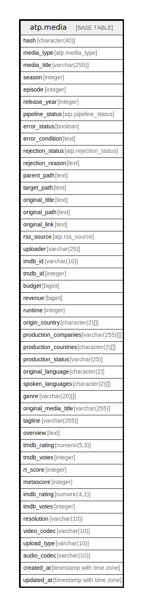

# atp.media

## Description

stores media data for movies, tv shows, and tv seasons

## Columns

| Name | Type | Default | Nullable | Children | Parents | Comment |
| ---- | ---- | ------- | -------- | -------- | ------- | ------- |
| hash | character(40) |  | false |  |  | primary key; unique identifier; and primary element for interaction with transmission |
| media_type | atp.media_type |  | false |  |  | either movie, tv_shows, or tv_season |
| media_title | varchar(255) |  | true |  |  | either movie or tv show title |
| season | integer |  | true |  |  | media season if tv show or tv season; null for movies |
| episode | integer |  | true |  |  | episode number within season for tv show, otherwise null |
| release_year | integer |  | true |  |  | year the movie was released or the year of the first season of a tv show |
| pipeline_status | atp.pipeline_status | 'ingested'::atp.pipeline_status | false |  |  | status within the automatic transmission pipeline |
| error_status | boolean | false | false |  |  | boolean value documenting errors occurring during pipeline |
| error_condition | text |  | true |  |  | details on error status |
| rejection_status | atp.rejection_status | 'unfiltered'::atp.rejection_status | false |  |  | rejection status based on filters within filter-parameters.json |
| rejection_reason | text |  | true |  |  | details on which filter flags were tagged, if rejection was caused |
| parent_path | text |  | true |  |  | parent dir of media library location for item |
| target_path | text |  | true |  |  | file or dir path for media library location |
| original_title | text |  | false |  |  | raw item title string value; used for parsing other field values |
| original_path | text |  | true |  |  | original path of item within media-cache |
| original_link | text |  | true |  |  | may contain either the direct download link or the magnet link |
| rss_source | atp.rss_source |  | true |  |  | source of rss feed for item ingestion, if any |
| uploader | varchar(25) |  | true |  |  | uploading entity of the media item |
| imdb_id | varchar(10) |  | true |  |  | from TMDB; IMDB identifier for media item |
| tmdb_id | integer |  | true |  |  | from TMDB; identifier for themoviedb.org API |
| budget | bigint |  | true |  |  | from TMDB; production budget of media item |
| revenue | bigint |  | true |  |  | from TMDB; current revenue of media item |
| runtime | integer |  | true |  |  | from TMDB; runtime in minutes of media item |
| origin_country | character(2)[] |  | true |  |  | from TMDB; primary country of production in iso_3166_1 format |
| production_companies | varchar(255)[] |  | true |  |  | from TMDB; array of production companies |
| production_countries | character(2)[] |  | true |  |  | from TMDB; array of countries where media item was produced in iso_3166_1 format |
| production_status | varchar(25) |  | true |  |  | from TMDB; current production status of media item |
| original_language | character(2) |  | true |  |  | from TMDB; primary language of media item in ISO 639 format |
| spoken_languages | character(2)[] |  | true |  |  | from TMDB; array of languages available encoded in ISO 639 format |
| genre | varchar(20)[] |  | true |  |  | from TMDB; array of genres associated with the movie |
| original_media_title | varchar(255) |  | true |  |  | from TMDB; original title of media item |
| tagline | varchar(255) |  | true |  |  | from TMDB; tagline for the media item |
| overview | text |  | true |  |  | from TMDB; brief plot synopsis of media item |
| tmdb_rating | numeric(5,3) |  | true |  |  | from TMDB; rating submitted by TMDB users out of 10 |
| tmdb_votes | integer |  | true |  |  | from TMDB; number of ratings by TMDB users |
| rt_score | integer |  | true |  |  | from OMDb; Rotten Tomatoes score out of 100 |
| metascore | integer |  | true |  |  | from OMDb; MetaCritic score out of 100 |
| imdb_rating | numeric(4,1) |  | true |  |  | from OMDb; IMDB rating out of 100 |
| imdb_votes | integer |  | true |  |  | from OMDb; number of votes on IMDB |
| resolution | varchar(10) |  | true |  |  | video resolution |
| video_codec | varchar(10) |  | true |  |  | video compression codec |
| upload_type | varchar(10) |  | true |  |  | uploading type indicating source of upload |
| audio_codec | varchar(10) |  | true |  |  | audio codec |
| created_at | timestamp with time zone | (CURRENT_TIMESTAMP AT TIME ZONE 'UTC'::text) | false |  |  | timestamp for initial database creation of item |
| updated_at | timestamp with time zone | (CURRENT_TIMESTAMP AT TIME ZONE 'UTC'::text) | false |  |  | timestamp of last database alteration of item |

## Constraints

| Name | Type | Definition |
| ---- | ---- | ---------- |
| media_budget_check | CHECK | CHECK ((budget >= 0)) |
| media_hash_check | CHECK | CHECK (((hash ~ '^[a-f0-9]+$'::text) AND (length(hash) = 40))) |
| media_imdb_id_check | CHECK | CHECK (((imdb_id)::text ~ '^tt[0-9]{7,8}$'::text)) |
| media_imdb_rating_check | CHECK | CHECK (((imdb_rating IS NULL) OR ((imdb_rating >= (0)::numeric) AND (imdb_rating <= (100)::numeric)))) |
| media_imdb_votes_check | CHECK | CHECK ((imdb_votes >= 0)) |
| media_metascore_check | CHECK | CHECK (((metascore IS NULL) OR ((metascore >= 0) AND (metascore <= 100)))) |
| media_release_year_check | CHECK | CHECK (((release_year >= 1850) AND (release_year <= 2100))) |
| media_revenue_check | CHECK | CHECK ((revenue >= 0)) |
| media_rt_score_check | CHECK | CHECK (((rt_score IS NULL) OR ((rt_score >= 0) AND (rt_score <= 100)))) |
| media_runtime_check | CHECK | CHECK ((runtime >= 0)) |
| media_tmdb_id_check | CHECK | CHECK ((tmdb_id > 0)) |
| media_tmdb_rating_check | CHECK | CHECK (((tmdb_rating >= (0)::numeric) AND (tmdb_rating <= (10)::numeric))) |
| media_tmdb_votes_check | CHECK | CHECK ((tmdb_votes >= 0)) |
| media_pkey | PRIMARY KEY | PRIMARY KEY (hash) |

## Indexes

| Name | Definition |
| ---- | ---------- |
| media_pkey | CREATE UNIQUE INDEX media_pkey ON atp.media USING btree (hash) |
| idx_media_imdb_id | CREATE INDEX idx_media_imdb_id ON atp.media USING btree (imdb_id) |
| idx_media_tmdb_id | CREATE INDEX idx_media_tmdb_id ON atp.media USING btree (tmdb_id) |
| idx_media_pipeline_status | CREATE INDEX idx_media_pipeline_status ON atp.media USING btree (pipeline_status) |

## Triggers

| Name | Definition |
| ---- | ---------- |
| update_media_updated_at | CREATE TRIGGER update_media_updated_at BEFORE UPDATE ON atp.media FOR EACH ROW EXECUTE FUNCTION atp.update_updated_at_column() |
| reset_fields_on_ingestion | CREATE TRIGGER reset_fields_on_ingestion BEFORE UPDATE ON atp.media FOR EACH ROW EXECUTE FUNCTION atp.reset_on_ingestion() |
| clear_error_condition | CREATE TRIGGER clear_error_condition BEFORE UPDATE ON atp.media FOR EACH ROW EXECUTE FUNCTION atp.reset_error_condition() |
| clear_rejection_reason | CREATE TRIGGER clear_rejection_reason BEFORE UPDATE ON atp.media FOR EACH ROW EXECUTE FUNCTION atp.reset_rejection_reason() |

## Relations

---

> Generated by [tbls](https://github.com/k1LoW/tbls)
